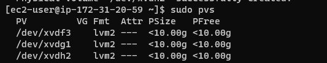

## STEP 1: PREPARE A WEB SERVER

###  Lunch Ec2 Instance , Create 3 Volume and Attach the Volume to Your Instance
### Open Linux Server and Start Configuration

`lsblk`

## Create Partition For Each Disk

`sudo gdisk /dev/xvdf`

`sudo gdisk /dev/xvdg`

`sudo gdisk /dev/xvdh`

## Install Lvm2

`sudo yum install lvm2`

`sudo lvmdiskscan `

## Create Physical Volume

`sudo pvcreate /dev/xvdf3`

` sudo pvcreate /dev/xvdg1`

`sudo pvcreate /dev/xvdh2`

`sudo pvs`

## Create Volume Group and Add the 3 Physical Volume

`sudo vgcreate webdata-vg /dev/xvdf3 /dev/xvdh2 /dev/xvdg1`

`sudo vgs`

## Creating Logical Volume (apps-lv and logs-lv)

`sudo lvcreate -n apps-lv -L 14G webdata-vg`

`sudo lvcreate -n logs-lv -L 14G webdata-vg`

`sudo lvs`

