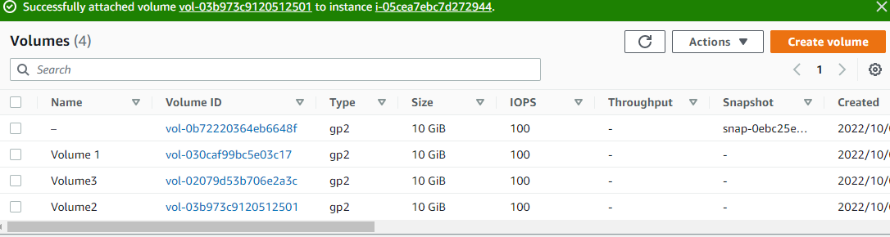
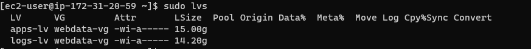

# LAUNCH AN EC2 INSTANCE THAT WILL SERVE AS “WEB SERVER”

## Step 1 — Prepare a Web Server

### Create 3 volumes in the same AZ as your Web Server EC2, each of 10 GiB.

`lsblk`

###  Create a single partition on each of the 3 disks

`sudo gdisk /dev/xvdf`

`sudo gdisk /dev/xvdg`

`sudo gdisk /dev/xvdh`

### Install lvm2 package

`sudo yum install lvm2`

`sudo lvmdiskscan`

### Physical Volume Creation

`sudo pvcreate /dev/xvdf1`

`sudo pvcreate /dev/xvdh1`

`sudo pvcreate /dev/xvdg1`

### Creating Volume Group and Adding the 3 Physical Volume Into it

`sudo vgcreate webdata-vg /dev/xvdh1 /dev/xvdg1 /dev/xvdf1`

### Create 2 Logical Volume

`sudo lvcreate -n apps-lv -L 15G webdata-vg`

`sudo lvcreate -n logs-lv -L 14G webdata-vg`

### Format the Logical Volumes With ext4 Filesystem

`sudo mkfs -t ext4 /dev/webdata-vg/apps-lv`

`sudo mkfs -t ext4 /dev/webdata-vg/logs-lv`

###  Creating Directories to Store and Mount

`sudo mkdir -p /var/www/html`

`sudo mkdir -p /home/recovery/logs`

`sudo mount /dev/webdata-vg/apps-lv /var/www/html/`

`sudo rsync -av /var/log/. /home/recovery/logs/`

`sudo mount /dev/webdata-vg/logs-lv /var/log`

`sudo rsync -av /home/recovery/logs/. /var/log`

### Update the UUID IN `/etc/fstab` File

`sudo blkid /dev/webdata-vg/apps-lv`

`sudo vi /etc/fstab`

`:!sudo blkid /dev/webdata-vg/logs-lv`

` sudo mount -a`

`sudo systemctl daemon-reload`

`df -h`

## Step 2 — Prepare the Database Server

`lsblk`

`sudo gdisk /dev/xvdb`

`sudo gdisk /dev/xvdc`

`sudo yum install lvm2`

`sudo pvcreate /dev/xvdb1`

`sudo pvcreate /dev/xvdc1`

`sudo vgcreate DBdata-vg /dev/xvdb1 /dev/xvdc1`

`sudo lvcreate -n db-lv -L 8G DBdata-vg`

`sudo lvcreate -n logs-lv -L 7G DBdata-vg`

`sudo mkfs -t ext4 /dev/DBdata-vg/db-lv`

`sudo mkfs -t ext4 /dev/DBdata-vg/logs-lv`

`sudo mkdir -p /db`

`sudo mkdir -p /home/recovery/logs`

`sudo mount /dev/DBdata-vg/db-lv /db`

`sudo rsync -av /var/log/. /home/recovery/logs/`

`sudo mount /dev/DBdata-vg/logs-lv /var/log`

`sudo rsync -av /home/recovery/logs/. /var/log`

`sudo blkid /dev/DBdata-vg/db-lv`

`sudo vi /etc/fstab`

`:!sudo blkid /dev/DBdata-vg/logs-lv`

`sudo mount -a`

`sudo systemctl daemon-reload`

### Step 3 — Install WordPress on your Web Server EC2

`sudo yum -y update`

`sudo yum -y install wget httpd php php-mysqlnd php-fpm php-json`

`sudo systemctl enable httpd`

`sudo systemctl start httpd`
### Install PHP and it’s depemdencies

`sudo yum install https://dl.fedoraproject.org/pub/epel/epel-release-latest-8.noarch.rpm`

`sudo yum install yum-utils http://rpms.remirepo.net/enterprise/remi-release-8.rpm`

`sudo yum module list php`

`sudo yum module reset php`

`sudo yum module enable php:remi-7.4`

`sudo yum install php php-opcache php-gd php-curl php-mysqlnd`

`sudo systemctl start php-fpm`

`sudo systemctl enable php-fpm`

`setsebool -P httpd_execmem 1`

`sudo systemctl restart httpd`

`sudo mkdir wordpress`

` cd wordpress`

`sudo wget http://wordpress.org/latest.tar.gz`

`sudo tar -xzvf latest.tar.gz`

`sudo rm -rf latest.tar.gz`

`sudo cp wordpress/wp-config-sample.php wordpress/wp-config.php`

`sudo cp -R wordpress /var/www/html/`

` sudo chown -R apache:apache /var/www/html/wordpress`

` sudo chcon -t httpd_sys_rw_content_t /var/www/html/wordpress -R`

`sudo setsebool -P httpd_can_network_connect=1`

### Step 4 — Install MySQL on your DB Server EC2

`sudo yum update`

`sudo yum install mysql-server`

`sudo systemctl restart mysqld`

`sudo systemctl enable mysqld`

### Step 5 — Configure DB to work with WordPress

`sudo vi /etc/my.cnf`

### Step 6 — Configure WordPress to connect to remote database

`sudo vi wp-config.php`

